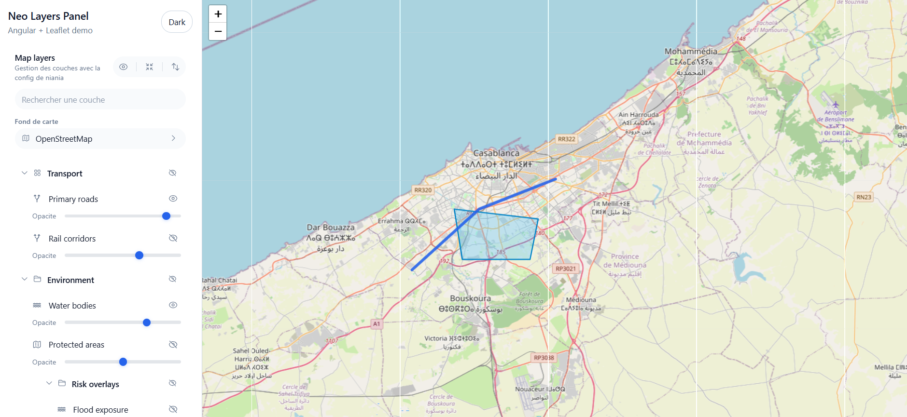
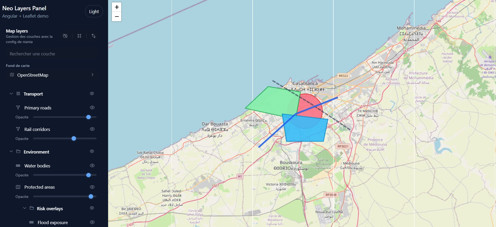
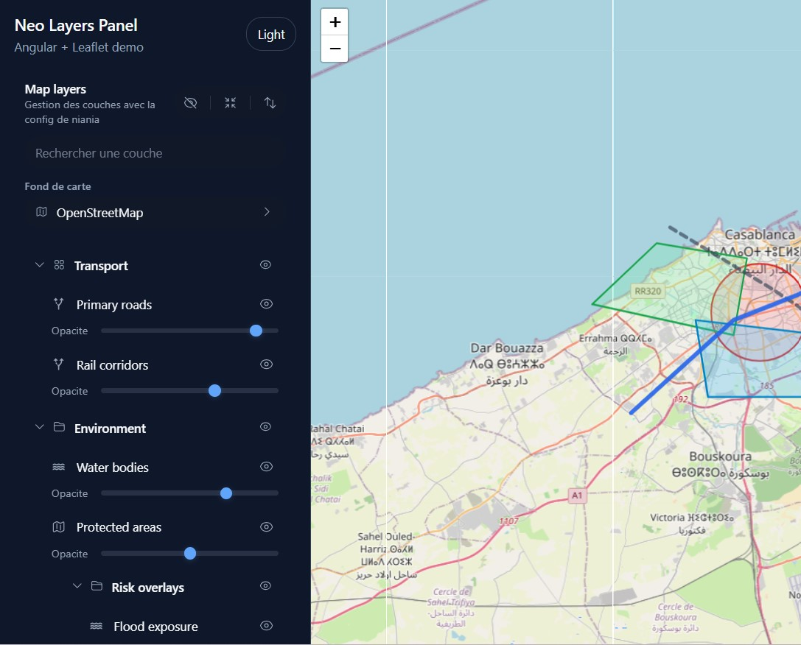

# Neo Maps

[](https://nx.dev)
[](https://www.typescriptlang.org)
[](https://angular.dev)
[](https://leafletjs.com)
[](https://pnpm.io)
[](LICENSE)

**Neo Maps** is a modular open-source ecosystem for building GIS frontend SDKs.

The first module is **Leaflet Layer Panel**: a framework-agnostic layer management system for Leaflet with Angular as the first adapter implementation. The architecture is designed so future modules can live beside it.

<p align="center">
  
</p>
<p align="center">
  
</p>
<p align="center">
  
</p>


## Current Module

### Leaflet Layer Panel

A production-oriented SDK for managing Leaflet layers:

- grouped overlay panels
- base layer selection
- visibility toggles
- opacity controls
- search and filtering
- lazy loading
- URL synchronization
- local storage persistence
- layer ordering
- SVG icon registry
- shared theming with CSS variables and Tailwind tokens
- Angular adapter, with React and Vue placeholders

## Packages

| Package | Role |
| --- | --- |
| `@neo-maps/leaflet-layer-panel` | Framework-independent Leaflet layer engine, state, events, loading, and map orchestration. |
| `@neo-maps/leaflet-layer-panel-angular` | Standalone Angular adapter and Tailwind UI. |
| `@neo-maps/leaflet-layer-panel-react` | Placeholder React adapter surface. Coming soon |
| `@neo-maps/leaflet-layer-panel-vue` | Placeholder Vue adapter surface. Coming soon |
| `@neo-maps/layer-panel-headless` | Rendering-neutral tree models and interaction contracts. |
| `@neo-maps/layer-panel-icons` | Framework-independent SVG icon registry. |
| `@neo-maps/layer-panel-theme` | CSS variables, design tokens, theme creator, and Tailwind preset. |
| `@neo-maps/layer-panel-utils` | Persistence, URL sync, layer rules, query parsing, and browser-safe helpers. |

## Quick Start

Install the Angular adapter and Leaflet:

```bash
npm install leaflet @neo-maps/leaflet-layer-panel-angular
```

The Angular adapter installs the required Neo Maps packages for you:

```text
@neo-maps/leaflet-layer-panel
@neo-maps/layer-panel-icons
@neo-maps/layer-panel-theme
```

For local development in this monorepo:

```bash
corepack enable
pnpm install
pnpm nx serve demo-angular
```

## Architecture

```text
apps/demo-angular
  -> adapter-angular
    -> core
    -> ui-headless
    -> icons
    -> theme
    -> utils
```

UI components never touch Leaflet directly. They call adapter services, which delegate to `LayerPanelCore`, `MapEngine`, `LayerManager`, and `LayerLoader`.

See [docs/architecture.md](docs/architecture.md), [docs/theming.md](docs/theming.md), and [RELEASE_NOTES.md](RELEASE_NOTES.md).

## Roadmap

- stabilize the Leaflet Layer Panel API
- publish packages independently
- complete React and Vue adapters
- add more Neo Maps modules around common GIS workflows
- prepare semantic versioning and release automation
